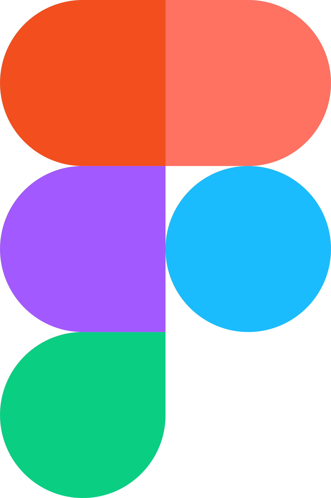

<h1 align="center"><em>📚💻 GitGud 💻📚</em> </h1>
<p align = "center">


<p align = "center">
 
</p>

## 📋 Description
### <em>We are Team GitGud, and our mission is to create an interactive online school. Our platform is designed to make learning not only easier but also more enjoyable. Through a series of tests, learners can test their knowledge. Additionally, we provide assignments that offer further practice for those looking to deepen their understanding. To enhance the learning experience, we also offer 3D models, which help visualize complex concepts, making them easier to comprehend.</em>

## 🚀 Languages
<br>
<div align="left"> 

</div>

## 🎨Design
<br>
<div align="left">
    
    
 
</div>

## 📞Collaborative services
<br>
<div align="left">
 
  
</div>

## Installation
1. Clone the repo.
```
git clone https://github.com/codingburgas/sprint-eschool-gitgud.git
```
2. Open the solution file with Visual Studio
3. Compile the project by using CTRL + F5
## 📁 Documents

### Documentation
- [Documentation](gitGut/docs/documentation.docx)


### Presenting
- [Presentation](gitGut/docs/presentation.pptx)


### Design
- [Design](gitGut/docs/design.png)


## 👥 Team

| **Name** | **Role** | **Grade** |
| :---:   | :---: | :---: |
| Beloslava Ileva | Scrum trainer | 🟥 9B |
| Ivelin Metodiev | Front - End Developer  | 🟩 9V  |
| Ivayla Keserdzhieva | Back - End developer  | 🟦 9G|
| Ekaterina Zalinskaya | Designer  | 🟥 9B |
